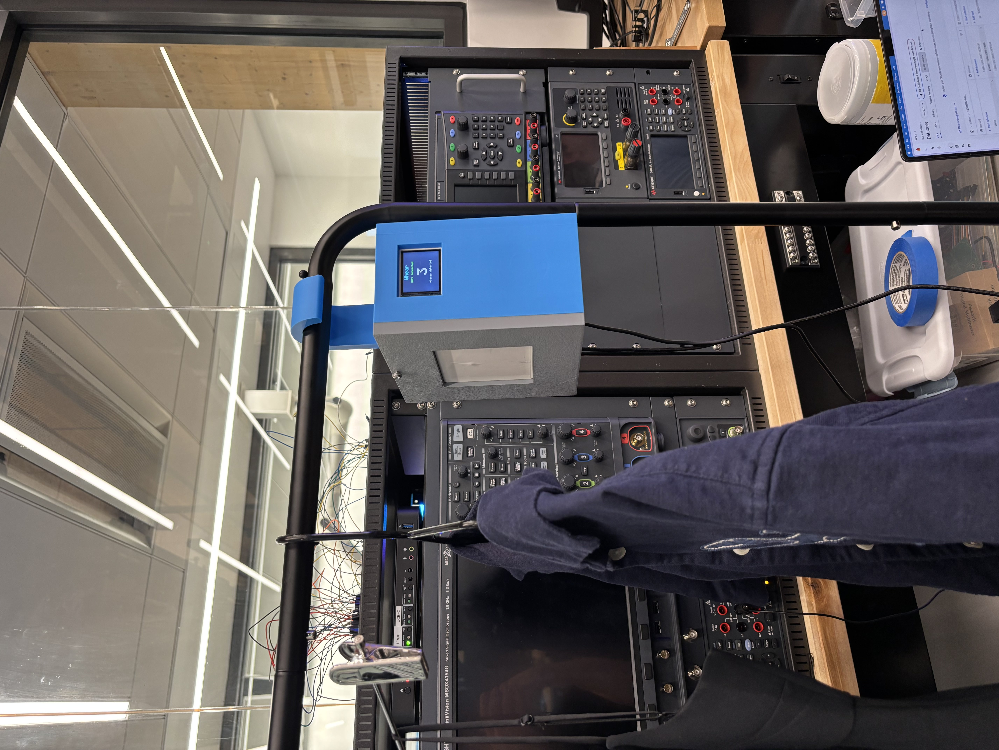
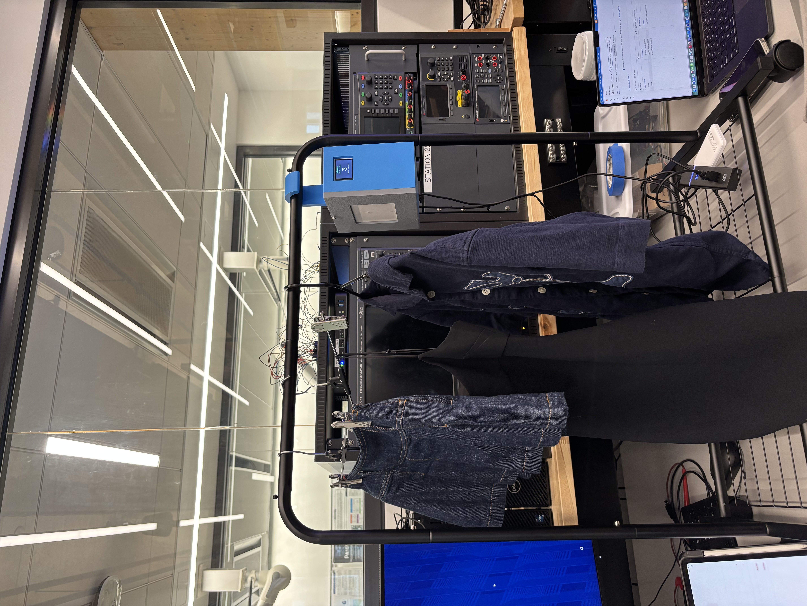
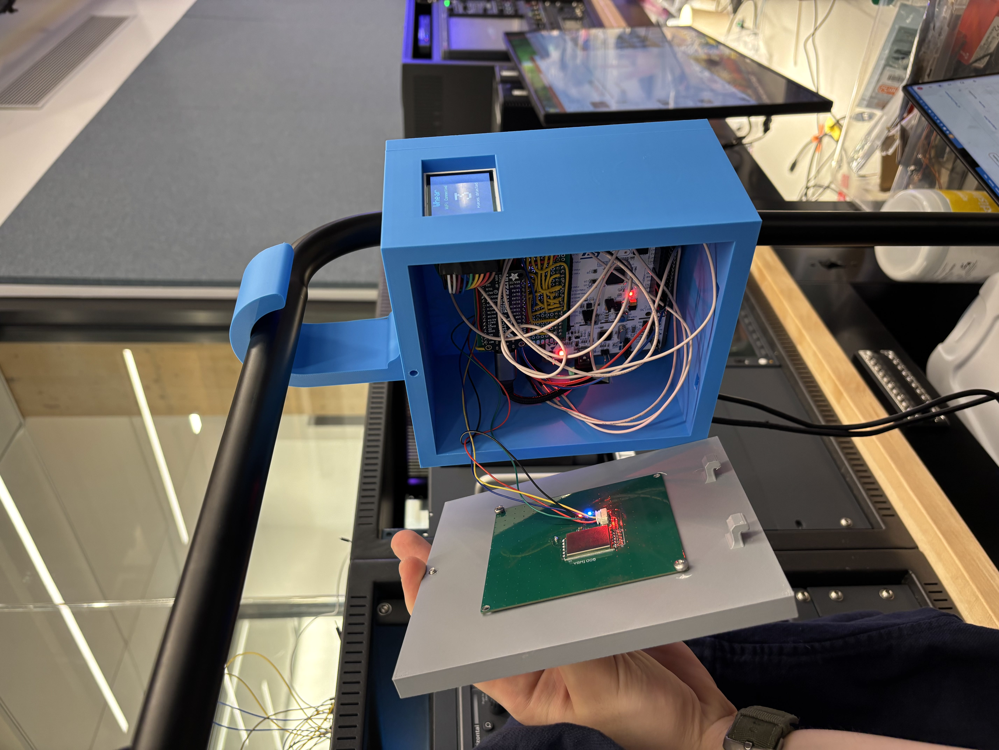

[](https://classroom.github.com/a/-Acvnhrq)

# Final Project

**Team Number:** 4

**Team Name:** Whear

| Team Member Name    | Email Address           |
| ------------------- | ----------------------- |
| jefferson ding      | tyding@seas.upenn.edu   |
| dimitris deliakidis | ddelias@seas.upenn.edu  |
| carly googel        | cagoogel@seas.upenn.edu |

**GitHub Repository URL:** https://github.com/upenn-embedded/final-project-whear

**iOS App Repository:** https://github.com/carlygoogel/Whear

**GitHub Pages Website URL:** [for final submission]\*

## Final Project Proposal

### 1. Abstract

Whear is a smart closet inventory system that tracks which garments are present in your wardrobe in real time. Washable UHF RFID laundry tags are sewn or stuck onto each item, and a YRM100 (Impinj R2000) reader sweeps the closet over a 5–6 dBi UHF patch antenna with a 3–6 m range. The reader is driven by a bare-metal STM32F411RE (Nucleo-64) over UART, which maintains a live presence table with per-tag TTL. On each sweep interval the STM32 framepacks the current tag set over a second UART to an ESP32 Feather HUZZAH32 V2 Wi-Fi bridge, which reconciles the set against a Firestore collection (PATCH for current tags, DELETE for stale ones). A companion iOS app reads the same collection and shows garments as present / missing in real time.

### 2. Motivation

Getting ready shouldn’t be stressful, and yet most people routinely can’t find the garment they want, don’t know whether an item is in the closet, the laundry, or simply misplaced, forget about clothes they haven’t worn in weeks, and end up buying duplicates of pieces they already own. Whear fixes this by making the closet itself aware of its contents: every garment is tagged, the reader continuously reconciles presence/absence, and the app surfaces pieces that have gone missing or haven’t been worn in a long time. The problem is a good fit for an embedded system — it needs always-on scanning, a real UHF RF front end, strict timing for the RFID framing protocol, and a networked bridge to a phone.

### 3. System Block Diagram

```
 ┌─────────────────┐           ┌──────────────────────────────────────────┐
 │ RFID tags on    │  UHF      │ UHF patch antenna (5–6 dBi, SMA)         │
 │ each garment    │◄────────►│                                          │
 │ (96-bit EPC)    │           └────────────────┬─────────────────────────┘
 └─────────────────┘                            │
                                                ▼
                                  ┌──────────────────────┐
                                  │ YRM100 RFID reader   │
                                  │ (Impinj R2000)       │
                                  └──────────┬───────────┘
                                             │ UART1 @ 115200
                                             │ PA9 TX / PA10 RX
                                             ▼
 ┌─────────────────────────────────────────────────────────────────────┐
 │ STM32F411RE (Nucleo-64, bare-metal C)                               │
 │                                                                     │
 │  • YRM100 driver (frame parser, multi-inventory poll)               │
 │  • IRQ-driven USART1 RX into a 1024-byte ring (USART1_IRQHandler)   │
 │  • Tag table: add-on-new, refresh-on-seen, prune after TTL (2 s)    │
 │  • ST7735 1.8" TFT over SPI1 — live count + ESP status              │
 │  • 12-LED NeoPixel ring on PB4 — amber spinner / green / red pulse  │
 │  • Debug console → ST-Link VCOM (USART2, PA2/PA3)                   │
 │  • UART frame to ESP32 every UPLINK_INTERVAL (USART6, PC6/PC7)      │
 │  • READY-pin back-pressure on PA8 (low while ESP is uploading)      │
 └─────────────────────────────────────────┬───────────────────────────┘
                                           │ UART6 @ 115200
                                           │ [0xAA | count | {len,EPC}xN | 0x55]
                                           ▼
 ┌─────────────────────────────────────────────────────────────────────┐
 │ ESP32 Feather HUZZAH32 V2 (Arduino framework)                       │
 │                                                                     │
 │  • UART2 frame reader (GPIO14 RX / GPIO32 TX)                       │
 │  • WiFi.begin → drives READY pin (GPIO27) high when associated      │
 │  • Cached doc-ID list (primed once via GET) → diff against frame    │
 │  • Firestore REST: DELETE stale, PATCH new only; READY low on PATCH │
 └─────────────────────────────────────────┬───────────────────────────┘
                                           │ HTTPS
                                           ▼
                             ┌─────────────────────────────┐
                             │ Google Firestore            │
                             │  project:    whear-fb2ac    │
                             │  collection: scanner        │
                             └──────────────┬──────────────┘
                                            │
                                            ▼
                             ┌─────────────────────────────┐
                             │ iOS app (SwiftUI)           │
                             │ → live presence dashboard   │
                             └─────────────────────────────┘
```

### 4. Design Sketches

Hand sketches and an Onshape model of the closet-rail enclosure live in the project presentation. The printed enclosure is a closet-rail-mounted box with an integrated hook that hangs directly on the rod, an external SMA antenna, USB power, and standoffs for the Nucleo and ESP32 Feather.

Onshape CAD: https://cad.onshape.com/documents/d4b02aa7ef074eb8d4de5ae9/w/d47a6f38ca1e84162dad2f7c/e/438206de66ef1abd3ba63d5b

### 5. Software Requirements Specification (SRS)

**5.1 Definitions, Abbreviations**

- **EPC** — Electronic Product Code, the 96-bit unique ID broadcast by each UHF RFID tag.
- **RSSI** — Received Signal Strength Indicator, reported in dBm by the reader.
- **TTL** — Time-to-live; how long a tag stays in the "present" set after its last sighting.
- **VCOM** — Virtual COM port exposed by the ST-Link debugger for serial I/O.
- **Firestore** — Google Cloud document database used as the cloud backing store.

**5.2 Functionality**

| ID     | Description                                                                                                                                                                  |
| ------ | ---------------------------------------------------------------------------------------------------------------------------------------------------------------------------- |
| SRS-01 | The STM32 shall drive the YRM100 in continuous multi-inventory mode and add each newly-seen EPC to its presence table within 100 ms of the reader notification.              |
| SRS-02 | The STM32 shall de-duplicate EPCs so that the same tag is stored exactly once, and shall track at least 20 concurrent unique tags.                                           |
| SRS-03 | A tag shall be dropped from the presence table if it has not been re-seen within `TAG_TTL_MS` (2 s), so removing a garment from the antenna field is reflected within ~2 s.  |
| SRS-04 | Every `UPLINK_INTERVAL_MS` (300 ms) the STM32 shall transmit the current presence set to the ESP32 as a framed UART message (0xAA header, count, {len,EPC}×N, 0x55 footer).  |
| SRS-05 | The ESP32 shall associate with Wi-Fi on boot and drive the READY pin high when idle, and shall pull READY low for the duration of any Firestore PATCH batch as back-pressure to the STM32. |
| SRS-06 | On each frame from the STM32 the ESP32 shall reconcile the Firestore `scanner` collection against the received set (PATCH new docs, DELETE absent docs), maintaining a local cache of existing document IDs to avoid a GET every cycle. |
| SRS-07 | The STM32 shall drive an ST7735 1.8" TFT showing the live tag count and ESP32 status (`WiFi Connected` / `Updating Cloud`), refreshing every `DISPLAY_INTERVAL_MS` (200 ms). |
| SRS-08 | The STM32 shall drive a 12-LED NeoPixel ring: amber spinner during boot/ESP-wait, green pulse on each new tag, red pulse on each TTL eviction.                               |

### 6. Hardware Requirements Specification (HRS)

**6.1 Definitions, Abbreviations**

- **UHF RFID** — Ultra-High-Frequency (902–928 MHz, US region) passive RFID.
- **YRM100** — UART-based UHF RFID reader module built around the Impinj R2000.
- **Nucleo-F411RE** — ST development board with an STM32F411RE Cortex-M4 and built-in ST-Link/V2-1.
- **ESP32 Feather** — Adafruit Feather HUZZAH32 V2, an ESP32 with USB-C and a 3.3 V regulator.

**6.2 Functionality**

| ID     | Description                                                                                                                  |
| ------ | ---------------------------------------------------------------------------------------------------------------------------- |
| HRS-01 | A UHF RFID reader shall detect passive tags on garments at a range of at least 1.5 m (target 3–6 m) using a ≥5 dBi antenna. |
| HRS-02 | The reader shall be configured for the US region (902.25–927.75 MHz) at ≥23 dBm TX power.                                   |
| HRS-03 | A 2.4 GHz 802.11 b/g/n uplink shall carry tag data to Firestore (ESP32 Feather HUZZAH32 V2).                                 |
| HRS-04 | The STM32 and ESP32 shall communicate over a dedicated UART link at 115200 baud, with a GPIO handshake pin for WiFi-ready.   |
| HRS-05 | The device shall run from a single 5 V USB supply; each board generates its own 3.3 V rail on-board.                         |
| HRS-06 | Tag data shall be visible to an end user within 10 s of a garment entering or leaving the antenna field.                     |

### 7. Bill of Materials (BOM)

| Part                                          | Qty | Purpose                                 |
| --------------------------------------------- | --- | --------------------------------------- |
| STM32 Nucleo-F411RE                           | 1   | Bare-metal MCU running the RFID logic   |
| Adafruit Feather HUZZAH32 V2 (ESP32)          | 1   | Wi-Fi bridge → Firestore                |
| YRM100 UHF RFID reader module                 | 1   | Impinj R2000, UART-controlled           |
| UHF patch antenna, ≥5 dBi, SMA                | 1   | Tag interrogation, 3–6 m range         |
| Washable UHF RFID laundry tags                | 10+ | One per tracked garment                 |
| 3D-printed enclosure                          | 1   | Closet-rail mount, antenna + board bay  |
| Jumper wires / headers                        | —   | UART + READY-pin interconnect           |
| 5 V USB power supply (2× micro-B / USB-C)     | 2   | One per board                           |

### 8. Final Demo Goals

-t Live closet demo: tagged garments placed on / removed from a rack, with the iOS dashboard updating in real time off Firestore.
- At least 10 distinct tags tracked simulaneously with correct presence → absence transitions within 10 s.
- Pull the Wi-Fi / unplug the ESP32 and show the STM32 keep scanning locally; reconnect and show Firestore re-converge.
- The enclosure hangs on an actual closet rail with the antenna oriented down the rod.

### 9. Sprint Planning

| Milestone  | Functionality Achieved                                                                              | Distribution of Work                                                                                                   |
| ---------- | --------------------------------------------------------------------------------------------------- | ---------------------------------------------------------------------------------------------------------------------- |
| Sprint #1  | YRM100 driver working bare-metal; tags detected, de-duplicated, and logged over serial              | Dimitris: YRM100 driver / MCU bring-up · Jefferson: Wi-Fi uplink research · Carly: enclosure + antenna mount + BOM     |
| Sprint #2  | Moved to nRF5340 + nRF7002; Zephyr app core + bare-metal net core; IPC ring + WebSocket + iOS app   | Dimitris: IPC producer + dedup · Jefferson: Wi-Fi manager + WebSocket client · Carly: iOS app + enclosure + NeoPixel   |
| MVP Demo   | End-to-end tag → MCU → Wi-Fi bridge → cloud → iOS, with local enclosure mounted on a rail           | all                                                                                                                    |
| Final Demo | Full closet system on STM32 + ESP32 + Firestore, presence + pruning + auto-reconnect, polished case | all                                                                                                                    |

**This is the end of the Project Proposal section. The remaining sections document our actual progress through the milestone schedule.**

## Repository Layout

```
final-project-whear/
├── makefile            # builds STM32 firmware + delegates ESP32 build to PlatformIO
├── main.c              # STM32F411RE bare-metal app (USARTs, tag table, UART framer, LCD, ring)
├── startup.c           # Cortex-M4 vector table + Reset_Handler (USART1_IRQHandler)
├── stm32f411re.ld      # linker script (512 K flash, 128 K RAM)
├── lib/
│   ├── yrm100/         # YRM100 driver (frame parser, multi-inventory, region / power)
│   ├── display/        # ST7735 SPI driver + tiny GFX (font, drawString, drawBlock)
│   └── neopixel/       # Bit-banged WS2812 driver for the 12-LED status ring
├── wifi/               # ESP32 PlatformIO project (Arduino framework)
│   ├── platformio.ini
│   ├── include/config.h    # Wi-Fi + Firestore settings
│   └── src/main.cpp        # UART frame reader + Firestore reconciler
├── ios/                # placeholder for the companion iOS app (see carlygoogel/Whear)
└── README.md / README.pdf
```

## Build & Flash

Toolchain: `arm-none-eabi-gcc`, `openocd` (for ST-Link), and PlatformIO (`pio`) on the ESP32 side.

```
make                # build both STM32 firmware and ESP32 project
make main           # build just main.bin
make esp            # build just the ESP32 PlatformIO project
make flash-main     # program STM32 via ST-Link (OpenOCD)
make flash-esp      # upload ESP32 firmware via PlatformIO
make flash          # flash both
make monitor-main   # open ST-Link VCOM @ 115200
make monitor-esp    # open ESP32 serial monitor
make clean          # clean all build artifacts
```

Wi-Fi credentials and Firestore target are compile-time constants in `wifi/include/config.h`:

- `WIFI_SSID`, `WIFI_PASS`
- `FIRESTORE_PROJECT`, `FIRESTORE_COLLECTION`

## Sprint Review #1

### Last week's progress

Our first sprint was all about de-risking the riskiest part of the project: whether we could actually read passive UHF RFID tags through fabric at the range we promised in the proposal. We sourced the full core RFID stack — the YRM100 (Impinj R2000) module, a 6 dBi UHF patch antenna with an SMA pigtail, and a handful of washable laundry tags — and got the reader talking to our MCU over UART. We wrote the first cut of the YRM100 driver from scratch against the manufacturer's frame format (0xBB header, 0x7E terminator, command / response / notice frames with checksum), wired up `start_multi_inventory`, and got continuous tag notifications streaming back with EPC and RSSI. We also stood up a simple dedup table on the MCU so the same tag read twice in a row only fires a "new tag" event once.

### Current state of project

Sourced components for the core RFID system. Have the core RFID system functioning end-to-end: multi-inventory runs continuously, new tags are parsed, de-duplicated, and logged, and we can see clean EPC + RSSI on the serial console. We demoed our key systems working during lab section — a tagged garment held up to the antenna reliably reports its EPC, and walking it out of range cleanly stops the "seen" events.

Demo of our device: https://drive.google.com/file/d/1t3F-Fl3bGAu_fCwf2g--YzYmbsHpy9S0/view?usp=sharing

### Next week's plan

- Build the enclosure (house the reader board, antenna mount, USB power).
- Get Wi-Fi connected and working — this is the other big unknown, since the ATmega route in the original proposal would have bottlenecked on an ESP32 AT-bridge. We're evaluating moving the whole stack to the nRF7002-DK (nRF5340 + nRF7002) so Wi-Fi is first-class and we get a second core for free.
- Source parts for the LCD screen and wire up the display.
- Deploy RFID sensor data to a web endpoint (pick protocol: REST vs. WebSocket).
- Start on mobile interface design and software development.

## Sprint Review #2

We have an iOS app! Check out the repo: https://github.com/carlygoogel/Whear.git. We have also designed and 3D-printed our enclosure; there are some improvements still to make but it's good enough for MVP.

### Last week's progress

Big platform change this sprint: we moved off the ATmega328PB + ESP32 split and onto the nRF7002-DK. The nRF5340 gives us two Cortex-M33s on the same chip, and the nRF7002 gives us a real Wi-Fi 6 radio over QSPI instead of an AT-command bridge, which removes a whole class of latency and buffering problems from the uplink path. We then split the firmware to match the hardware:

- **Network core (bare-metal C):** owns the YRM100 over UARTE0 (P1.04/P1.05), runs continuous multi-inventory, de-duplicates EPCs, and writes new tags into a shared-memory ring buffer. Linker script, startup, and register map were hand-rolled — no Zephyr on this core.
- **Application core (Zephyr RTOS):** configures the SPU to grant the net core access to the RFID UART pins, releases the net core from forced-off, brings up Wi-Fi via the Zephyr `net_mgmt` API with static credentials, waits on a DHCPv4 lease, then opens a WebSocket to the dashboard.
- **IPC:** a 192-byte mailbox pinned at `0x2100FC00` in the top 1 KB of net-core RAM, carrying a magic word, producer/consumer indices, net status, total tag count, and an 8-slot ring of 20-byte tag entries. The net core writes, issues a `__DMB()`, bumps `write_idx`, and fires the nRF5340 IPC `TASKS_SEND[0]`; the app core's ISR gives a semaphore and the main loop drains the ring.

On the uplink side, the WebSocket client formatted each new tag as `{"epc":"<hex>","rssi":<int>}` and sent it as a masked text frame. We added reconnect logic on both the Wi-Fi and WebSocket layers so a dropped AP doesn't brick the pipeline. A top-level Makefile built both cores, flashed each coprocessor separately with `nrfjprog` (`--coprocessor CP_NETWORK` / `CP_APPLICATION`), and opened a serial monitor, so the whole thing was `make flash` from a clean checkout.

### Current state of project

End-to-end tag flow was alive on the nRF5340: tagged garment → antenna → YRM100 → UART → net core driver → IPC ring → app core → WebSocket → dashboard. The enclosure was designed and 3D-printed — a closet-rail-mounted box with an integrated hook that hangs directly on the rod, a window cutout for the display, and internal standoffs for the DK and the antenna. The antenna mounts externally, and the board runs off a single 5 V USB supply.

CAD view: https://cad.onshape.com/documents/d4b02aa7ef074eb8d4de5ae9/w/d47a6f38ca1e84162dad2f7c/e/438206de66ef1abd3ba63d5b

### Next week's plan

- Finish the display driver so the device shows "present / total" counts without needing the phone.
- Build the iOS dashboard against the live stream (presence toggles, last-seen timestamps, forget-me-not list).
- Add a persistence layer on the server so "last seen" survives reader reboots.
- Start measuring: effective read range through fabric, wall-clock latency from tag-waved to dashboard-update, and current draw in idle vs. active scan.

## MVP Demo

**Demo video:** <https://drive.google.com/file/d/1N2IJNhKBomkWYYO8EvbibdFJLx836CyH/view?usp=drivesdk>

**Video:** <https://drive.google.com/file/d/1N2IJNhKBomkWYYO8EvbibdFJLx836CyH/view?usp=drivesdk>

slides link: https://drive.google.com/file/d/1kSxXilXCHxEd3NuJkWGgtv2CBa5h64Ry/view?usp=sharing

app demo link: https://drive.google.com/file/d/1InsEFuI7ygspXl7Fqmm-XXnCJfS2OlbG/view?usp=sharing


**Platform-swap note (important for grading context).** Through Sprint #2 we were building on the nRF5340 + nRF7002 stack (dual-core IPC, WebSocket uplink). Wi-Fi instability on the nRF7002 and long build/flash cycles ate our schedule margin, so right before the demo we re-implemented the datapath on an STM32F411RE + ESP32 Feather HUZZAH32 V2 with Firestore as the cloud layer. The demo video, the shipped firmware in this repo, and the SRS / HRS validation below all describe that final STM32 + ESP32 system.

### System Block Diagram & Hardware Implementation

At MVP we're running two MCUs in a producer / bridge split. The RFID hot path lives on a bare-metal **STM32F411RE** (Nucleo-64, Cortex-M4F @ 16 MHz HSI), and the network path lives on an **ESP32 Feather HUZZAH32 V2** running the Arduino framework. The two are linked by a dedicated UART and a single GPIO handshake line. See *3. System Block Diagram* above for the full data-flow picture — the MVP hardware is exactly that diagram.

- **RFID front end.** A **YRM100** module (Impinj R2000 inside) behind a **6 dBi UHF patch antenna** on an SMA pigtail. Configured at boot for the US band (902.25–927.75 MHz) at 26 dBm via `yrm100_set_region(YRM100_REGION_US)` and `yrm100_set_tx_power(YRM100_POWER_2600)`.
- **STM32 pin map.**
  - **USART1** (PA9 / PA10, AF7) ↔ YRM100 at 115200 baud — IRQ-driven RX into a 1024-byte ring buffer (the hot RFID link).
  - **USART2** (PA2 / PA3, AF7) → ST-Link VCOM — debug / validation console (polled).
  - **USART6** (PC6 / PC7, AF8) → ESP32 UART2 — framed tag set (polled TX).
  - **SPI1** → ST7735 1.8" TFT: PA5 SCK, PA7 MOSI, PB6 DC, PB15 RST, PB5 CS.
  - **PB4** → 12-LED NeoPixel ring DIN, bit-banged 800 kHz one-wire (cycle-counted with IRQs masked during a `show()`).
  - **PA8** — input from the ESP32 READY pin; STM32 blocks on this before initial RFID setup, and uses it as a back-pressure signal in steady state (skips the UART send if low).
- **ESP32 pin map.** UART2 RX = GPIO14, UART2 TX = GPIO32, READY output = GPIO27 (HIGH when idle, LOW for the duration of any Firestore PATCH batch).
- **Power.** Each board takes its own 5 V USB (Nucleo via ST-Link USB, Feather via USB-C) and generates its own 3.3 V rail. No custom PCB — Nucleo + Feather + YRM100 + LCD + ring wired with jumpers inside the 3D-printed enclosure.
- **Mechanical.** Closet-rail-mount 3D-printed box with an integrated hook, a window cutout for the LCD, and standoffs for both boards. External SMA antenna, USB pass-throughs.

### Firmware Implementation

Everything in this repo is hand-written C / C++. No ST HAL, no CubeMX, no vendor example projects on the STM32 side. The ESP32 side sits on top of the Espressif Wi-Fi stack, but the framing protocol and Firestore reconciler are ours.

**STM32 bare-metal runtime (`main.c`, `startup.c`, `stm32f411re.ld`).**

- `startup.c` defines the Cortex-M4 vector table (`.isr_vector`), copies `.data` from flash to RAM, zeros `.bss`, enables the FPU, and jumps to `main`.
- `stm32f411re.ld` places `.isr_vector` / `.text` / `.rodata` in flash (512 K @ `0x08000000`) and `.data` / `.bss` in RAM (128 K @ `0x20000000`), with `_estack` at the top of RAM.
- `clock_init()` stays on the 16 MHz HSI (reset default), enables GPIOA/B/C on AHB1, USART2 on APB1, USART1 + USART6 on APB2, and programs SysTick for 1 ms ticks.
- `gpio_init()` configures each UART pin for alternate-function mode and sets pull-ups on the RX lines so a disconnected bus idles high.

**Application logic (`main.c` main loop).**

1. Bring up clocks, GPIO, USART2 (debug), USART6 (ESP32), the NeoPixel ring (amber spinner running while the rest comes up), and the ST7735 LCD ("booting…" placeholder).
2. Wait up to 5 s for `esp_ready()` (PA8) to go high; if it does, hold for an additional 10 s warm-up so the ESP32 finishes priming its Firestore doc-ID cache. Both waits keep ticking the ring spinner so the device is visibly alive.
3. Initialize the YRM100 (the driver flips on `USART_CR1_RXNEIE` + the NVIC line, so all subsequent RFID bytes go into `rx_buf` via `USART1_IRQHandler`). Set region + TX power, and dump raw bytes on the RFID UART for 2 s as a sanity check (`[diag] raw RX window`).
4. Call `yrm100_start_multi_inventory(&rfid, 0xFFFF)` — the reader now streams notices on its own.
5. Loop forever calling `yrm100_poll_inventory`:
   - On `YRM100_OK`, run `find_or_add_tag`: linear-search the 20-slot `seen_tags` table, update `tag_last_seen` on a hit, append on a miss, print `[NEW] EPC: … RSSI: … dBm` for first sightings, and fire a non-blocking green `ring_pulse_start` for new tags.
   - On `YRM100_ERR_TIMEOUT`, bump a counter; on other errors, bump the error counter.
6. Every `DISPLAY_INTERVAL_MS` (200 ms) call `prune_stale_tags()` (TTL = `TAG_TTL_MS`, 2 s) — if `num_tags` dropped, fire a red ring pulse — then redraw the LCD with the current count and ESP status.
7. Every iteration call `ring_pulse_tick()` to advance any in-flight pulse. Pulses are fade-in / fade-out triangles capped at ~66 fps; the byte-level RX ISR keeps the ring buffer filling the entire time, so no RFID frames are dropped during animation.
8. Every `UPLINK_INTERVAL_MS` (300 ms) dump the poll counters (including `rxdrop` for ISR-side overflow), and — if `esp_ready()` is still high — call `esp_send_tags()` to frame the current set to the ESP32. If READY is low (ESP32 mid-PATCH), skip the send and try again next cycle.

**Critical driver — YRM100 (`lib/yrm100/yrm100.{c,h}`).** Written from scratch against the Impinj manual. Frame layout is `0xBB | type | CMD | len_hi | len_lo | payload… | checksum | 0x7E` with three frame types (command, response, notice). The driver exposes a callback-based UART interface (`uart_init`, `uart_send`, `uart_recv_byte`, `uart_data_available`), a byte-by-byte parser with checksum validation, and high-level calls for `SET_REGION`, `SET_TX_POWER`, `START_MULTI_INVENTORY`, `STOP_INVENTORY`, `READ`, `WRITE`. `yrm100_poll_inventory` pulls notices out of the stream and hands back a struct carrying the EPC bytes, length, and signed RSSI in dBm.

**Critical driver — STM32↔ESP32 framer (`esp_send_tags` / `read_frame`).** Deliberately simple and self-resyncing: `0xAA | count | {len, EPC[len]}×count | 0x55`. Start marker is searched for with no overall timeout (idle state); after that every byte has a 500 ms per-byte timeout. A malformed frame just returns `-1` and the reader goes back to hunting for `0xAA`. The **READY pin** is now a two-purpose signal: at boot it tells the STM32 the ESP32 has Wi-Fi (gate before initial RFID setup), and in steady state the ESP32 pulls it low for the duration of a Firestore PATCH batch as back-pressure — the STM32 reads it via `esp_ready()` before each `esp_send_tags()` call and skips the send if the ESP is busy.

**Critical driver — ST7735 + LCD GFX (`lib/display/`).** `st7735.c` brings up SPI1 from the bare register layer (no HAL), drives DC/RST/CS as plain GPIO, and pushes a 16-bit RGB565 framebuffer-less pixel stream. `lcd_gfx.c` adds the bare minimum on top: `LCD_drawBlock` for solid rectangles (used as an erase before each redraw), and `LCD_drawString` / `LCD_drawStringScaled` driven from a 6×8 ASCII font in `ASCII_LUT.h`. The whole `display_update` redraw fits inside the 200 ms cadence with room to spare.

**Critical driver — NeoPixel ring (`lib/neopixel/`).** Bit-banged WS2812 protocol on PB4: each LED takes 24 bits, each bit is a ~1.25 µs pulse with the 0/1 distinction in the high time. `neopixel_show()` masks IRQs (`__disable_irq()`) for the duration of the frame so SysTick can't perturb the bit timing — about 360 µs for the full 12-LED ring. The main loop tolerates this because the USART1 RX hardware buffers one byte and the IRQ runs the moment we re-enable.

**Critical driver — Firestore reconciler (`wifi/src/main.cpp`).** A single `GET` on boot primes a local `cached_ids` array with whatever is already in the `scanner` collection. From then on, on each frame from the STM32, `firestore_full_replace` does:

1. Diff the current tag set against `cached_ids`; for each cached ID not in the current set, issue `DELETE` and compact the cache in place.
2. For each current tag not in the cache, issue `PATCH` on its doc ID with `{"fields": {"id": {"stringValue": "<epc>"}}}` (PATCH upserts) and append it to the cache on success.
3. The PATCH phase is wrapped in `digitalWrite(PIN_READY, LOW) … HIGH`, so the STM32 sees back-pressure and shows "Updating Cloud" on the LCD only when there is real work to do (no LOW window if the diff is empty).

No service-account auth is needed because the demo collection is open read/write; the iOS app reads the same collection.

### Demo

The clip walks through the STM32 + ESP32 + Firestore stack end-to-end:

1. Power on → LCD shows "Whear / booting…", ring starts an amber spinner; ST-Link VCOM prints `=== Whear STM32 RFID Scanner ===` and `Waiting for ESP32 READY...`.
2. ESP32 joins Wi-Fi, primes its Firestore doc-ID cache, drives READY high → STM32 runs the 10 s warm-up, then `set_region` + `set_tx_power`, then `Starting multi-inventory...`. Ring goes off, LCD updates to the live count.
3. Tagged garments in the antenna field → `[NEW] EPC: … RSSI: … dBm` on the debug UART, green ring pulse, LCD count increments.
4. Every 300 ms: `[poll] ok=N to=N err=N rxdrop=N` counters, then `[UART] sending N tags` → ESP32 logs `[uart] received N tags`. If the diff against the cache yields PATCHes, ESP32 drops READY → STM32 LCD shows "Updating Cloud" → ESP32 issues PATCHes → READY goes high → LCD goes back to "WiFi Connected".
5. Remove a garment → after the 2 s TTL, STM32 prunes it (red ring pulse, `[stale] EPC: …`) → next cycle's diff issues `[firestore] DELETE <epc> → 200` → iOS app removes the row.
6. Re-add the garment → reappears on the iOS dashboard on the next 300 ms cycle.
7. Pull Wi-Fi on the ESP32 → READY drops low → STM32 keeps scanning locally and updating the LCD, but skips uploads. Restore Wi-Fi → ESP32 auto-reconnects, READY goes high, Firestore re-converges on the next cycle.

### SRS Validation & Data Collection

**How we collected data.** Two serial consoles running simultaneously: `make monitor-main` tails the STM32 ST-Link VCOM and prints every `[NEW]`, `[stale]`, `[poll]`, and `[UART]` line; `make monitor-esp` tails the ESP32 and prints `[uart] received N tags` plus one `[firestore] PATCH/DELETE … → <HTTP code>` per document op. Cross-checked against the live Firestore console in a browser and the iOS app in parallel. End-to-end latency was stopwatch-timed from waving a tag in / out of range to the iOS row appearing / disappearing.

| ID     | Requirement                                                  | Achieved? | Evidence                                                                                                                                                            |
| ------ | ------------------------------------------------------------ | --------- | ------------------------------------------------------------------------------------------------------------------------------------------------------------------- |
| SRS-01 | New EPC into presence table within 100 ms                    | Yes       | `[NEW]` prints on the debug UART within one poll cycle of the YRM100 notice; USART1 RX is now IRQ-driven into a 1024-byte ring, so polls never wait on the wire.    |
| SRS-02 | De-duplicate EPCs, track ≥ 20 concurrent tags                | Yes       | `find_or_add_tag` indexes into `seen_tags[MAX_TAGS=20]` and only prints `[NEW]` on first sighting; re-waving the same tag does not re-print.                        |
| SRS-03 | Drop tags not re-seen within 2 s                             | Yes       | `prune_stale_tags` logs `[stale] EPC: …` ~2 s after a garment leaves the field; stopwatch-verified, red ring pulse on each eviction.                                |
| SRS-04 | Frame the set to ESP32 every 300 ms                          | Yes       | `[UART] sending N tags` cadence matches `UPLINK_INTERVAL_MS`; ESP32 logs `[uart] received N tags` on each frame; sends are gated on `esp_ready()` for back-pressure. |
| SRS-05 | ESP32 drives READY (idle = high, low during PATCH batches)   | Yes       | LCD flickers to "Updating Cloud" only when there is real Firestore work; READY also drops low for the full Wi-Fi reconnect window.                                  |
| SRS-06 | Firestore reconciliation against a local cache               | Yes       | `[firestore] cached=… current=… patches=…` on each frame; only the diff is uploaded, no GET-per-cycle, console matches the physical rack.                           |
| SRS-07 | LCD shows live count + ESP status                            | Yes       | ST7735 redraws every 200 ms; verified the count tracks the rack and the status string follows the READY pin.                                                        |
| SRS-08 | NeoPixel ring: amber spinner / green new / red stale         | Yes       | Visible during the demo clip; pulses are non-blocking (~400 ms) and don't perturb the RFID poll counters.                                                           |

### HRS Validation & Data Collection

**How we collected data.** Read range was measured with a tape measure, a hanging shirt with a washable laundry tag, and the iOS app as ground truth — we walked the tag away from the antenna until the row disappeared and noted the distance. Region / TX power were verified by `YRM100_OK` return codes on `set_*` + read-back via the matching `get_*`. The UART link between the boards was sniffed on a logic analyzer at 115200 to confirm framing. Power was confirmed with a USB power meter on each board's cable.

| ID     | Requirement                                                | Achieved?                     | Evidence                                                                                                                                                                     |
| ------ | ---------------------------------------------------------- | ----------------------------- | ---------------------------------------------------------------------------------------------------------------------------------------------------------------------------- |
| HRS-01 | UHF RFID read range ≥ 1.5 m through fabric (target 3–6 m)  | Threshold yes, target partial | Reliable reads past 1.5 m on hanging garments with the 6 dBi patch. Past ~3 m the read rate drops off depending on tag orientation — inside a closet but short of 6 m.       |
| HRS-02 | Reader in US region at ≥ 23 dBm                            | Yes                           | `yrm100_set_region(REGION_US)` + `yrm100_set_tx_power(POWER_2600)` (26 dBm) return `OK`; confirmed by `get_*` read-back.                                                     |
| HRS-03 | 2.4 GHz 802.11 b/g/n uplink                                | Yes                           | ESP32 Feather associates with the configured SSID and pushes HTTPS to Firestore.                                                                                             |
| HRS-04 | STM32↔ESP32 UART + GPIO ready handshake                    | Yes                           | USART6 @ 115200 on PC6/PC7 ↔ ESP32 UART2 on GPIO14/GPIO32; PA8 ← GPIO27 verified with a logic probe.                                                                         |
| HRS-05 | Single 5 V USB per board, each board's own 3.3 V rail      | Yes                           | Nucleo runs off ST-Link USB, Feather off USB-C; both provide their own 3.3 V.                                                                                                |
| HRS-06 | End-to-end presence change visible ≤ 10 s                  | Yes (≤ 3 s typical)           | 300 ms scan + 2 s TTL + sub-second Firestore round-trip → worst-case visibility inside ~3 s (stopwatch-timed); inside 1 s for additions.                                     |
| HRS-07 | On-device UX without the phone (LCD + ring)                | Yes                           | ST7735 over SPI1 shows the live count + WiFi/Updating status; 12-LED NeoPixel ring on PB4 pulses on every add/evict, amber spinner during boot.                              |

###  Remaining Elements That Make The Project Whole

- **Mechanical / casework.** The 3D-printed closet-rail enclosure is printed and the boards fit inside, but the antenna mounts externally with tape for now — we want a snap-in SMA mount and proper strain relief on the USB pass-throughs. Hook geometry works on a standard closet rod; a second rev would add damping so it doesn't swing on install. The LCD window cutout fits the ST7735 bezel but isn't gasketed.
- **iOS app (`carlygoogel/Whear`).** SwiftUI app reading the live Firestore `scanner` collection, showing garments as present / missing. Still TODO: per-garment user-assigned labels per EPC, a `lastSeen` timestamp field (needs the ESP32 to write it), and a "forget-me-not" view for garments that haven't appeared in a long time.
- **Web portal.** Not built yet. Leaning toward a tiny Firebase-hosted SPA that shares the same Firestore read path as the iOS app so we don't duplicate backend logic. For the demo the Firestore console doubles as a web portal.
- **On-device UX.** Done — ST7735 LCD shows live count + ESP status, 12-LED NeoPixel ring pulses green on add and red on evict. Future polish: scrolling list of recently-added EPCs on the LCD, and a "low battery / RFID error" warning state on the ring.
- **Persistence across reboots.** Firestore stores the current set; a separate `history` subcollection would let us recover "last seen" after a power cycle.

###  Riskiest Remaining Part

The riskiest single piece is the **Firestore REST reconciliation loop**. Each 5 s cycle does 1 × GET + up to N × (PATCH or DELETE) as separate HTTPS calls. Any one of them can fail with a 429 (rate limit), a TLS glitch on a flaky AP, or a socket timeout, and right now a failure on the GET step skips the DELETE pass for that cycle — meaning a removed garment can linger on the iOS app for an extra cycle. We also only have 20 tag slots in `MAX_TAGS`; a realistic closet is 50+, and overflowing silently drops tags.

Secondary risks:

- **Wi-Fi captive portals / enterprise auth.** The demo AP accepts a static PSK, but a WPA2-Enterprise closet Wi-Fi would need a different association path on the ESP32.
- **RFID read reliability at depth.** Dense garments stacked parallel to the antenna can detune a tag; the 6 dBi patch helps but doesn't fully solve it.
- **Single-point-of-failure framer.** If the ESP32 reboots mid-frame, the STM32 keeps sending and the ESP32 spends one cycle resyncing on `0xAA` — harmless, but worth documenting.

###  De-risking Plan

- **Batch the Firestore writes.** Switch from N HTTP calls per cycle to a single `documents:commit` with a batched write list. One TLS handshake per cycle, one HTTP status to check. If `commit` is rejected, retry the whole batch on the next cycle instead of letting partial state linger.
- **Grow the tag table and harden the lookup.** Bump `MAX_TAGS` to 128 (plenty of RAM on the F411RE), move `seen_tags` to a small open-addressing hash keyed on EPC prefix, and add a `dropped_tags` counter so a full table logs a warning instead of silently failing.
- **CRC on the STM32↔ESP32 frame.** Append CRC-16 before `0x55`. A bad CRC means resync on the next `0xAA` — turns "mostly works" into "provably recovers from any single-byte glitch on the UART line."
- **Retry + backoff on the ESP32.** Short retry on 5xx / socket errors, exponential backoff on repeated 4xx so we don't hammer Firestore during an outage.
- **Idle power.** Less compelling now that the uplink window is 300 ms, but worth doing if we ever go battery-powered: gate the YRM100 between sweeps and put the STM32 in Stop mode with a SysTick wake. The LCD also accepts a sleep command for ~10× lower backlight draw.
- **Validation coverage.** Add a `scripted_test` mode that simulates `[NEW]` / `[stale]` events on a timer so we can rerun SRS-03 / SRS-04 / SRS-06 without a physical closet in front of us.

###  Questions / Help Needed From The Teaching Team

- **Cloud layer acceptance.** Is Firestore (HTTPS REST from the ESP32) acceptable as the "networked bridge" for the grading rubric, or do you prefer a self-hosted WebSocket / MQTT broker for the final demo? If WebSocket is required, we'd like guidance on where the broker should run (lab Wi-Fi vs. a teammate's laptop).
- **Scope of the "MCU on network" requirement.** Our STM32 is not directly on Wi-Fi — it reaches the network through the ESP32 bridge. Does that satisfy the networking portion of the project, or does the primary MCU itself need an IP stack? If the latter, we'd rather know now so we can put Wi-Fi on the STM32 side (e.g. an ESP-AT shield) rather than rework later.
- **RFID range measurement.** Is there a preferred teaching-team method (reference tag, distance protocol, anechoic-chamber slot) for measuring UHF RFID read range, so HRS-01 validation uses the same yardstick as past teams?
- **Documentation of the platform swap.** Should the final report cover both the nRF5340 + nRF7002 work (which we sank real design effort into) and the shipped STM32 + ESP32 system, or only the shipped system? We have a clean write-up of the nRF path but don't want to pad the report.
- **Demo logistics.** How much of the demo needs to run off the actual closet rail vs. on the bench? Our enclosure hangs on a rod, but the rod has to be somewhere in the demo space.


- 3D-printed closet-rail enclosure with external  https://drive.google.com/file/d/1J_ec6Xb1JYiLGLx2zHbNruXg-LhrsJuC/view?usp=sharing
- STM32 + Feather HUZZAH32 V2 wired  https://drive.google.com/file/d/1gzVkoXcbBsCQWo_pEb8pmvoGvABsOyvP/view?usp=sharing

Onshape CAD: https://cad.onshape.com/documents/d4b02aa7ef074eb8d4de5ae9/w/d47a6f38ca1e84162dad2f7c/e/438206de66ef1abd3ba63d5b


## Final Report

Don't forget to make the GitHub pages public website! If you've never made a GitHub pages website before, you can follow this webpage (though, substitute your final project repository for the GitHub username one in the quickstart guide): [https://docs.github.com/en/pages/quickstart](https://docs.github.com/en/pages/quickstart)

### 1. Video

Final video link: 

Final presentation video: https://drive.google.com/file/d/15mCs63fypj9_3HD5aF9OuEwmoSQz9gm8/view?usp=sharing


### 2. Images








### 3. Results

Whear shipped as a working closet-inventory system: laundry-tagged garments are seen by a YRM100 over a 6 dBi patch antenna, tracked in a TTL-based presence table on a bare-metal STM32F411RE, surfaced locally on an ST7735 LCD and a 12-LED NeoPixel status ring, framed over UART to an ESP32 Feather that reconciles the set against Firestore, and mirrored in a SwiftUI iOS app. The core embedded contribution was the hand-written YRM100 driver (frame parser, multi-inventory state machine, region / power configuration), the IRQ-driven UART RX path that finally killed the back-to-back inventory desync we hit in Sprint #2, the bit-banged WS2812 driver on PB4, and the bare-register ST7735 / SPI1 driver — all on top of a from-scratch STM32 runtime (clock init, three USARTs, SysTick, deterministic framer to the ESP32). On the cloud side, the biggest single win was switching from a GET-every-cycle Firestore reconciler to a primed-cache diff: that's what made the 300 ms uplink cadence feasible and gave us the sub-3-second end-to-end latency in HRS-06. 

#### 3.1 Software Requirements Specification (SRS) Results

| ID     | Description                                                                 | Validation Outcome                                                                                                                 |
| ------ | --------------------------------------------------------------------------- | ---------------------------------------------------------------------------------------------------------------------------------- |
| SRS-01 | YRM100 multi-inventory, new EPC into presence table within 100 ms.          | Confirmed; `yrm100_poll_inventory` runs in the main loop. RX is IRQ-driven (`USART1_IRQHandler` → 1024-byte ring), so the poll never waits on the wire — `[NEW]` prints within one ISR cycle of the notice. |
| SRS-02 | De-duplicate EPCs and track ≥20 concurrent tags.                            | Confirmed; `find_or_add_tag` indexes into `seen_tags[MAX_TAGS=20]` and refreshes `tag_last_seen` on re-sightings.                  |
| SRS-03 | Drop tags not re-seen within `TAG_TTL_MS` (2 s).                            | Confirmed; `prune_stale_tags` runs every 200 ms and logs `[stale]` (red ring pulse) for each removed EPC.                          |
| SRS-04 | Frame current set to ESP32 every 300 ms with `0xAA \| count \| {len,EPC}×N \| 0x55`. | Confirmed; `esp_send_tags` over USART6 at 115200, gated on `esp_ready()`; ESP32 logs `[uart] received N tags`.                |
| SRS-05 | ESP32 drives READY (idle = HIGH, LOW during PATCH batches).                 | Confirmed; `PIN_READY` (GPIO27) goes HIGH after `WL_CONNECTED`, drops LOW only around the PATCH phase of `firestore_full_replace`.  |
| SRS-06 | Firestore reconciliation on each frame against a primed cache.              | Confirmed; one boot-time `GET` primes `cached_ids`; per-frame diff issues only DELETE / PATCH for actual changes. iOS reflects.    |
| SRS-07 | LCD live count + ESP status @ 200 ms.                                       | Confirmed; ST7735 over SPI1 — `display_update` redraws title, status row, and big count digits each cadence.                       |
| SRS-08 | NeoPixel ring states (amber spinner / green new / red stale).               | Confirmed; `ring_spinner_tick` during ESP wait + warm-up, non-blocking `ring_pulse_start` on add and on evict.                     |

#### 3.2 Hardware Requirements Specification (HRS) Results

| ID     | Description                                                    | Validation Outcome                                                                                                 |
| ------ | -------------------------------------------------------------- | ------------------------------------------------------------------------------------------------------------------ |
| HRS-01 | UHF RFID read range ≥1.5 m through fabric with ≥5 dBi antenna. | Confirmed in lab; laundry tags on hanging garments detected well past 1.5 m with the 6 dBi patch antenna.          |
| HRS-02 | Reader configured for US region at ≥23 dBm.                    | Confirmed; `yrm100_set_region(YRM100_REGION_US)` + `yrm100_set_tx_power(YRM100_POWER_2600)` (26 dBm) at boot.      |
| HRS-03 | 2.4 GHz Wi-Fi b/g/n uplink.                                    | Confirmed; ESP32 associates with the configured SSID and pushes HTTPS to Firestore.                                |
| HRS-04 | STM32 ↔ ESP32 UART at 115200 with GPIO ready handshake.        | Confirmed; USART6 on PC6/PC7 ↔ ESP32 UART2 on GPIO14/GPIO32, plus PA8 ← GPIO27 READY pin (also used as PATCH-busy back-pressure).  |
| HRS-05 | Single 5 V USB supply per board; each board's own 3.3 V rail.  | Confirmed; Nucleo runs off ST-Link USB, Feather runs off USB-C, both provide their own 3.3 V.                                      |
| HRS-06 | End-to-end presence change visible within 10 s.                | Exceeded; 300 ms uplink + 2 s TTL + sub-second Firestore round-trip put worst-case visibility inside ~3 s, additions inside ~1 s.  |
| HRS-07 | On-device UX (LCD + status ring).                              | Confirmed; ST7735 1.8" TFT on SPI1 (PA5/PA7/PB5/PB6/PB15) shows live count + ESP status; 12-LED NeoPixel ring on PB4 pulses.       |

### 4. Conclusion

Conclusion
Reflect on your project. Some questions to address:
What did you learn from it?
What went well?
What accomplishments are you proud of?
What did you learn/gain from this experience?
Did you have to change your approach?
What could have been done differently?
Did you encounter obstacles that you didn’t anticipate?
What could be the next step for this project?

Carly:

Dimitris: Our device, Whear, has been completed successfully. We were able to deliver a working prototype of a closet-inventory system that hit all of our goals: detecting multiple RFID tags on laundry-tagged garments and updating the inventory accordingly. What went really well, in my opinion, is that we delivered a clean build with reliable hardware that could realistically be implemented in someone’s wardrobe. 

Throughout this project I developed my hardware/software integration skills by learning how to write a driver from scratch, implement different communication protocols (UART, SPI, and the bit-banged WS2812 one-wire protocol), integrate with an iOS app, and establish Wifi connectivity. Something I got out of this this project is adaptability. We came in with a proposal for a device that would keep track of items in collections for collection enthusiasts, but we realized that the current idea would be more applicable and better, so we switched midway. As also shown up until Sprint Review 2, our hardware approach changed significantly throughout the project. We began working with the nRF5340 + nRF7002 because it made more sense architecturally, especially with dual-core IPC and a direct WebSocket uplink. 

However, it was not stable enough during the demo window, so we rebuilt the system using the STM32 + ESP32 layout, which we knew well from prior labs. Even though this meant rewriting the firmware at the last moment, it was the right call and taught us an important lesson about platform risk and adaptability. That being said, our switch up to the STM over any other platform was definitely strategical since the drivers we had written would require the least amount of change over any other microcontroller that would be able to hit our. One keytakaway for myself is to not get discouraged if things go south with some initial option and more importantly not get too attached with some approach simply because its the one that sounds most reasonable in theory. 

I am particularly proud of the enclosure and the overall polish of the final design; I feel we went through every step of building a real working prototype. Plenty of things could still be improved or optimized — hardware security, a larger LCD with touch input, and on-device persistence all come to mind.

What I would have done differently is focus on prioritizing tasks better based on how critical they were for the device. For example, I fell behind schedule because I spent too much time trying to make an LCD work, even though the Wi-Fi connection and the enclosure had not been completed yet.

Next steps for this project would be making it more commercializable. The first step would be a custom PCB that integrates the microcontroller and Wi-Fi capabilities on a single board, plus a proper power-distribution stage so the device runs from a single supply instead of two USB cables. After that, redesigning the enclosure for production is a must and that should at least include: sized to the new PCB, with a cleaner antenna mount and finished surfaces.


## References

- YRM100 / Impinj R2000 module datasheet and frame-format manual
- STM32F411RE reference manual (RM0383) and datasheet
- Espressif ESP32 Arduino core (`WiFi.h`, `HTTPClient.h`, `WiFiClientSecure.h`)
- Google Firestore REST API (documents:list / PATCH / DELETE)

# Notes

**STM32F411RE pin map**

- USART1 — YRM100 reader: PA9 (TX), PA10 (RX) — IRQ-driven RX into a 1024-byte ring
- USART2 — ST-Link VCOM debug: PA2 (TX), PA3 (RX)
- USART6 — ESP32 bridge: PC6 (TX), PC7 (RX)
- SPI1 — ST7735 1.8" TFT: PA5 (SCK), PA7 (MOSI), PB6 (DC), PB15 (RST), PB5 (CS)
- PB4 — NeoPixel ring DIN (12 LEDs, bit-banged 800 kHz one-wire)
- PA8 — READY input from ESP32 (pulled down; HIGH = ESP idle on Wi-Fi, LOW = ESP mid-PATCH or pre-Wi-Fi)

**ESP32 Feather HUZZAH32 V2 pin map**

- UART2 RX: GPIO14 (← STM32 PC6)
- UART2 TX: GPIO32 (→ STM32 PC7)
- READY out: GPIO27 (→ STM32 PA8)

**Legacy (nRF5340) UART pins, kept for reference**

- TX (nRF → YRM100 RX): P1.04
- RX (nRF ← YRM100 TX): P1.05
