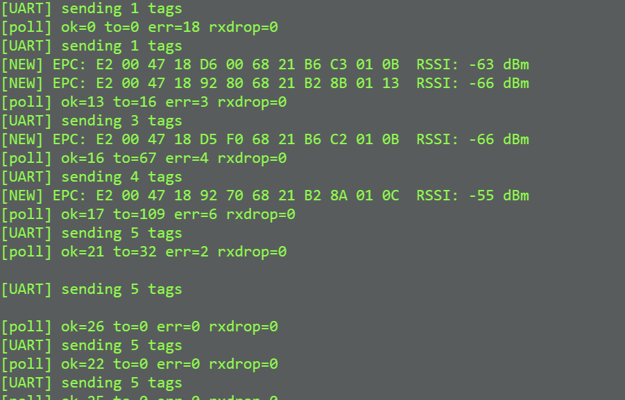

# Whear

**Team Number:** 4

**Team Name:** Whear

| Team Member Name    | Email Address           |
| ------------------- | ----------------------- |
| jefferson ding      | tyding@seas.upenn.edu   |
| dimitris deliakidis | ddelias@seas.upenn.edu  |
| carly googel        | cagoogel@seas.upenn.edu |

**GitHub Repository URL:** https://github.com/upenn-embedded/final-project-whear

**iOS App Repository:** https://github.com/carlygoogel/Whear

### 1. Video

### 2. Images

**Whear iOS App**

### Enclosure CAD (interactive)

<iframe src="https://www.viewstl.com/?embedded&bgcolor=white&color=darkblue&url=https://upenn-embedded.github.io/final-project-whear/cad/enclosure.stl"
        style="display:block;width:100%;max-width:1000px;height:600px;margin:1.5em auto;border:0;border-radius:12px;box-shadow:0 6px 24px rgba(0,0,0,.2);"
        allowfullscreen></iframe>

[Open in Onshape](https://cad.onshape.com/documents/d4b02aa7ef074eb8d4de5ae9/w/d47a6f38ca1e84162dad2f7c/e/438206de66ef1abd3ba63d5b)

### 3. Results

Whear shipped as a working closet-inventory system: laundry-tagged garments are seen by a YRM100 over a 6 dBi patch antenna, tracked in a TTL-based presence table on a bare-metal STM32F411RE, surfaced locally on an ST7735 LCD and a 12-LED NeoPixel status ring, framed over UART to an ESP32 Feather that reconciles the set against Firestore, and mirrored in a SwiftUI iOS app. The core embedded contribution was the hand-written YRM100 driver (frame parser, multi-inventory state machine, region / power configuration), the IRQ-driven UART RX path that finally killed the back-to-back inventory desync we hit in Sprint #2, the bit-banged WS2812 driver on PB4, and the bare-register ST7735 / SPI1 driver — all on top of a from-scratch STM32 runtime (clock init, three USARTs, SysTick, deterministic framer to the ESP32). On the cloud side, the biggest single win was switching from a GET-every-cycle Firestore reconciler to a primed-cache diff: that's what made the 300 ms uplink cadence feasible and gave us the sub-3-second end-to-end latency in HRS-06.

## System Block Diagram

flowchart TD
    tags["RFID tags 96-bit EPC"]
    antenna["UHF patch antenna 5–6 dBi, SMA"]
    reader["YRM100 RFID reader Impinj R2000"]
    stm["<b>STM32F411RE</b> (Nucleo-64, bare-metal C) • YRM100 driver • IRQ-driven USART1 RX • Tag table + 2 s TTL • ST7735 LCD over SPI1 • 12-LED NeoPixel ring"]
    esp["<b>ESP32 Feather HUZZAH32 V2</b> (Arduino framework) • UART2 frame reader • Cached doc-ID list • Firestore PATCH / DELETE"]
    fs[("Google Firestore project: whear-fb2ac collection: scanner")]
    ios["iOS app (SwiftUI) live presence dashboard"]

    tags <-->|UHF| antenna
    antenna --> reader
    reader -->|"UART1 @ 115200 PA9 / PA10"| stm
    stm -->|"UART6 @ 115200 0xAA · count · tags · 0x55"| esp
    esp -->|HTTPS| fs
    fs --> ios

    classDef hw    fill:#e8f4f8,stroke:#1a5f7a,stroke-width:2px,color:#000;
    classDef mcu   fill:#fef3c7,stroke:#92400e,stroke-width:2px,color:#000;
    classDef cloud fill:#fce7f3,stroke:#9d174d,stroke-width:2px,color:#000;
    classDef app   fill:#dcfce7,stroke:#166534,stroke-width:2px,color:#000;

    class tags,antenna,reader hw;
    class stm,esp mcu;
    class fs cloud;
    class ios app;

#### Software Requirements Specification (SRS) Results

| ID     | Description                                                                          | Validation Outcome                                                                                                                                                                                          |
| ------ | ------------------------------------------------------------------------------------ | ----------------------------------------------------------------------------------------------------------------------------------------------------------------------------------------------------------- |
| SRS-01 | YRM100 multi-inventory, new EPC into presence table within 100 ms.                   | Confirmed; `yrm100_poll_inventory` runs in the main loop. RX is IRQ-driven (`USART1_IRQHandler` → 1024-byte ring), so the poll never waits on the wire — `[NEW]` prints within one ISR cycle of the notice. |
| SRS-02 | De-duplicate EPCs and track ≥20 concurrent tags.                                     | Confirmed; `find_or_add_tag` indexes into `seen_tags[MAX_TAGS=20]` and refreshes `tag_last_seen` on re-sightings.                                                                                           |
| SRS-03 | Drop tags not re-seen within `TAG_TTL_MS` (2 s).                                     | Confirmed; `prune_stale_tags` runs every 200 ms and logs `[stale]` (red ring pulse) for each removed EPC.                                                                                                   |
| SRS-04 | Frame current set to ESP32 every 300 ms with `0xAA \| count \| {len,EPC}×N \| 0x55`. | Confirmed; `esp_send_tags` over USART6 at 115200, gated on `esp_ready()`; ESP32 logs `[uart] received N tags`.                                                                                              |
| SRS-05 | ESP32 drives READY (idle = HIGH, LOW during PATCH batches).                          | Confirmed; `PIN_READY` (GPIO27) goes HIGH after `WL_CONNECTED`, drops LOW only around the PATCH phase of `firestore_full_replace`.                                                                          |
| SRS-06 | Firestore reconciliation on each frame against a primed cache.                       | Confirmed; one boot-time `GET` primes `cached_ids`; per-frame diff issues only DELETE / PATCH for actual changes. iOS reflects.                                                                             |
| SRS-07 | LCD live count + ESP status @ 200 ms.                                                | Confirmed; ST7735 over SPI1 — `display_update` redraws title, status row, and big count digits each cadence.                                                                                                |
| SRS-08 | NeoPixel ring states (amber spinner / green new / red stale).                        | Confirmed; `ring_spinner_tick` during ESP wait + warm-up, non-blocking `ring_pulse_start` on add and on evict.                                                                                              |

SRS-07: serial monitor screenshot shows how STM32 sends new tags to ESP32: 
SRS-08: Video demonstration: https://drive.google.com/file/d/1LMR6zpGG7_tcq9WGxoNr0-2pcL2efwNc/view?usp=sharing

####  Hardware Requirements Specification (HRS) Results

| ID     | Description                                                    | Validation Outcome                                                                                                                 |
| ------ | -------------------------------------------------------------- | ---------------------------------------------------------------------------------------------------------------------------------- |
| HRS-01 | UHF RFID read range ≥1.5 m through fabric with ≥5 dBi antenna. | Confirmed in lab; laundry tags on hanging garments detected well past 1.5 m with the 6 dBi patch antenna.                          |
| HRS-02 | Reader configured for US region at ≥23 dBm.                    | Confirmed; `yrm100_set_region(YRM100_REGION_US)` + `yrm100_set_tx_power(YRM100_POWER_2600)` (26 dBm) at boot.                      |
| HRS-03 | 2.4 GHz Wi-Fi b/g/n uplink.                                    | Confirmed; ESP32 associates with the configured SSID and pushes HTTPS to Firestore.                                                |
| HRS-04 | STM32 ↔ ESP32 UART at 115200 with GPIO ready handshake.       | Confirmed; USART6 on PC6/PC7 ↔ ESP32 UART2 on GPIO14/GPIO32, plus PA8 ← GPIO27 READY pin (also used as PATCH-busy back-pressure). |
| HRS-05 | Single 5 V USB supply per board; each board's own 3.3 V rail.  | Confirmed; Nucleo runs off ST-Link USB, Feather runs off USB-C, both provide their own 3.3 V.                                      |
| HRS-06 | End-to-end presence change visible within 10 s.                | Exceeded; 300 ms uplink + 2 s TTL + sub-second Firestore round-trip put worst-case visibility inside ~3 s, additions inside ~1 s.  |
| HRS-07 | On-device UX (LCD + status ring).                              | Confirmed; ST7735 1.8" TFT on SPI1 (PA5/PA7/PB5/PB6/PB15) shows live count + ESP status; 12-LED NeoPixel ring on PB4 pulses.       |
| HRS-08 | Hardware enclosure management — clean wiring inside the case.  | Confirmed; a soldered perfboard sits on the Nucleo's male headers and breaks out the UART, SPI, and GPIO lines to the YRM100, ESP32 Feather, ST7735 LCD, and NeoPixel ring. No breadboards or flying jumpers — every board can be unplugged and re-plugged without losing any connections. |

### Conclusion

**Jefferson: **

Looking back on this project, what stands out the most is how much time we spent working with a module that almost nobody else gets to touch. The YRM100 is built around the Impinj R2000, which is a chip you mostly see in warehouse and logistics deployments, not in classroom electronics. UHF RFID is well established in supply chain and inventory work, but the per-tag and per-reader cost has historically kept it out of consumer settings, which is part of why nobody is shipping a smart closet built around this stack. Getting to actually wire one up, configure the region and TX power, and watch passive tags get inventoried in real time felt like working with a piece of "real" industrial hardware that I would not have otherwise seen.

That novelty came with a real cost on the firmware side. The only thing the manufacturer ships is a PDF describing the wire protocol, so building the YRM100 driver was effectively starting from a blank file with the frame format on one monitor. I wrote the byte-level parser, the checksum logic, the multi-inventory state machine, and the high-level wrappers for region and TX power configuration completely from scratch. There were no example projects to crib from and no Arduino library to fall back on, which was frustrating early on but ended up being one of the most useful things I have done in any course, because it forced me to actually understand the protocol instead of trusting somebody else's abstraction.

Our hardware path was also a lot less direct than the proposal suggests. We started on the nRF5340 plus nRF7002 because the integrated Wi-Fi 6 and dual core layout looked like the cleanest possible architecture, but the Wi-Fi stack on that platform was not stable enough inside our build cycle. We then briefly considered the ATmega328PB, which we already knew well from labs, but it does not have enough UART/USART peripherals to talk to the YRM100, the ESP32, and the debug console at the same time without a software serial workaround that would have hurt the RFID timing. The STM32F411RE was the third platform we landed on, and it stuck because it had three free USARTs, real DMA-capable peripherals, and enough headroom that we could keep an IRQ-driven RX path alongside the SPI display and the bit-banged NeoPixel ring without any of them stepping on each other.

One thing I am genuinely proud of is how cleanly everything came together physically. We built a perfboard that uses the male headers on the Nucleo as a base, so the whole system plugs into the dev board directly, and the ESP32 Feather, the YRM100, the LCD, and the ring all break out from there. There are no breadboards inside the enclosure, no flying jumpers held together with tape, and the entire thing can be unplugged and re-plugged without losing any connections. For a class project that started as a wiring nightmare on the bench, ending up with something that looks and feels like an actual product was a really satisfying outcome.

If we had more time, the thing I would change is the balance between firmware and software. Right now the STM32 is mostly responsible for tag detection, dedup, and TTL pruning, and almost everything that you would actually call "inventory tracking" lives on the iOS app and the Firestore schema. The device on its own does not really know what a "garment" is, just what an EPC is. A more mature version of this project would push more of that logic down into the firmware so that the embedded device itself owns the inventory state, with the app and the cloud being views on top of it rather than the source of truth.

Next steps follow from that pretty directly. I would want to optimize the firmware so the device can do useful inventory work standalone, build out the iOS app to something closer to production quality with per-garment labels and a real "haven't worn this in a while" view, and redesign the enclosure for actual real-world closet use, with a cleaner antenna mount and a single-supply power input instead of two USB cables. The bones of a shippable product are here; it is mostly a question of pushing each layer past "demo quality."

**Carly:**

As a systems engineer who had not taken many of the typical prerequisites for this course, this project pushed me to learn quickly and deeply. I developed a strong understanding of how low-level operations, like bitwise logic with ones and zeros using "or equals", "and not equals", directly control timers, clocks, and interrupts at the bare-metal level. This shifted my perspective from abstract code to truly understanding how software interfaces with hardware.

What went well was my ability to adapt and build intuition despite initial gaps in background. I am especially proud of getting a working system that integrates both hardware and software components, and of becoming more comfortable debugging at a low level.

This experience reinforced how important it is to reason from first principles in embedded systems. I also learned that progress often required changing my approach, moving from trial-and-error to more structured debugging and referencing documentation more deliberately.

One challenge I did not fully anticipate was how time-consuming low-level debugging can be, especially when small mistakes in register configuration cause unexpected behavior. In retrospect, I could have been more systematic earlier on and invested more time upfront in planning and understanding the architecture before implementing.

A natural next step for this project would be to build more abstraction layers on top of the current system, making it easier to extend functionality while still preserving the efficiency of the low-level implementation.

Overall, I am grateful to Professor McGill-Gardner for being an incredible teacher and for guiding me through this learning process.

**Dimitris:**

Our device, Whear, has been completed successfully. We were able to deliver a working prototype of a closet-inventory system that hit all of our goals: detecting multiple RFID tags on laundry-tagged garments and updating the inventory accordingly. What went really well, in my opinion, is that we delivered a clean build with reliable hardware that could realistically be implemented in someone’s wardrobe.

Throughout this project I developed my hardware/software integration skills by learning how to write a driver from scratch, implement different communication protocols (UART, SPI, and the bit-banged WS2812 one-wire protocol), integrate with an iOS app, and establish Wifi connectivity. Something I got out of this this project is adaptability. We came in with a proposal for a device that would keep track of items in collections for collection enthusiasts, but we realized that the current idea would be more applicable and better, so we switched midway. As also shown up until Sprint Review 2, our hardware approach changed significantly throughout the project. We began working with the nRF5340 + nRF7002 because it made more sense architecturally, especially with dual-core IPC and a direct WebSocket uplink.

However, it was not stable enough during the demo window, so we rebuilt the system using the STM32 + ESP32 layout, which we knew well from prior labs. Even though this meant rewriting the firmware at the last moment, it was the right call and taught us an important lesson about platform risk and adaptability. That being said, our switch up to the STM over any other platform was definitely strategical since the drivers we had written would require the least amount of change over any other microcontroller that would be able to hit our. One keytakaway for myself is to not get discouraged if things go south with some initial option and more importantly not get too attached with some approach simply because its the one that sounds most reasonable in theory.

I am particularly proud of the enclosure and the overall polish of the final design; I feel we went through every step of building a real working prototype. Plenty of things could still be improved or optimized — hardware security, a larger LCD with touch input, and on-device persistence all come to mind.

What I would have done differently is focus on prioritizing tasks better based on how critical they were for the device. For example, I fell behind schedule because I spent too much time trying to make an LCD work, even though the Wi-Fi connection and the enclosure had not been completed yet.

Next steps for this project would be making it more commercializable. The first step would be a custom PCB that integrates the microcontroller and Wi-Fi capabilities on a single board, plus a proper power-distribution stage so the device runs from a single supply instead of two USB cables. After that, redesigning the enclosure for production is a must and that should at least include: sized to the new PCB, with a cleaner antenna mount and finished surfaces.

## References

- YRM100 / Impinj R2000 module datasheet and frame-format manual
- STM32F411RE reference manual (RM0383) and datasheet
